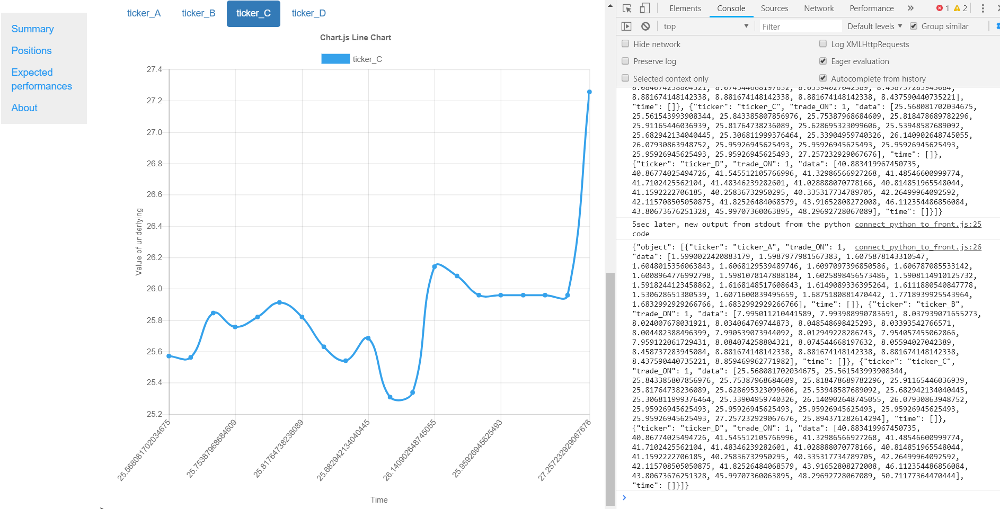
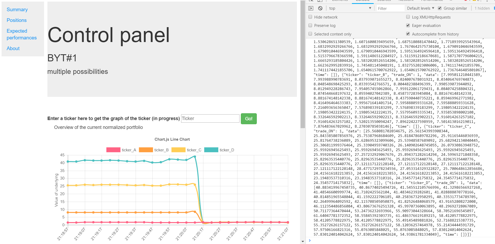

# Front_end_trend_following
**

Creation of a front-end in javascript using Electron to connect the python back-end and a nice smooth front end.
python shell is run.

some ugly screenshot of this first version:

